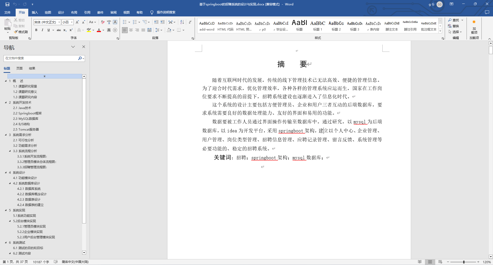
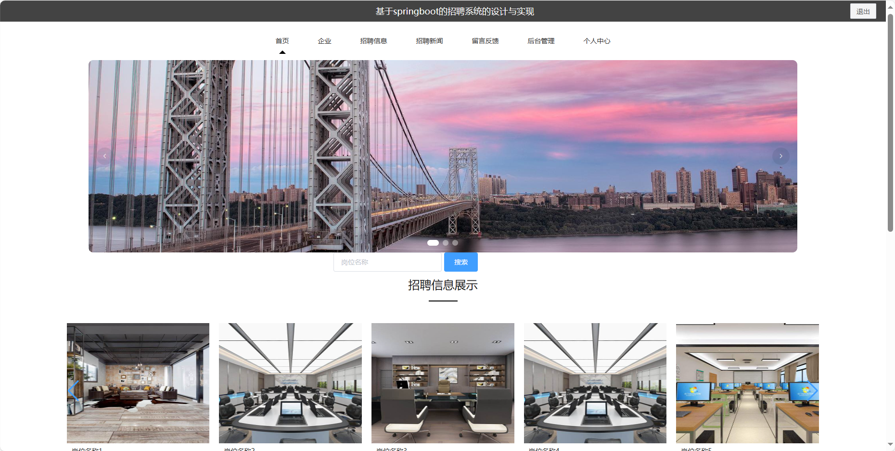
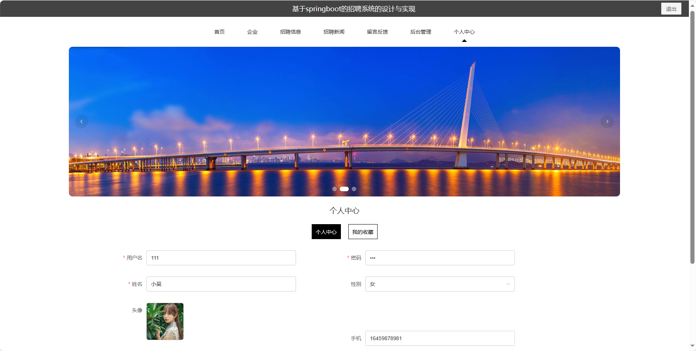
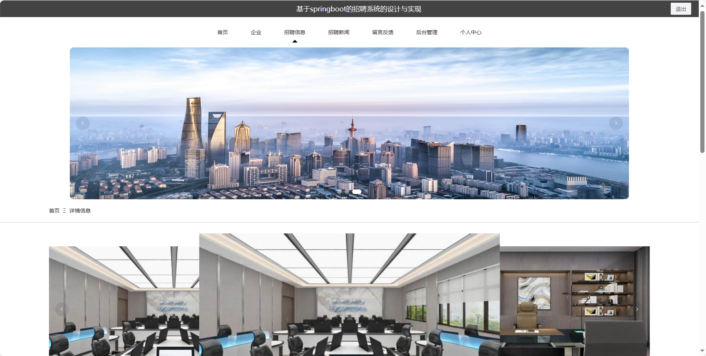

基于Springboot的招聘系统（程序+论文）
=
### 完整代码获取地址：从戎源码网 ([https://armycodes.com/](https://armycodes.com/))
### 作者微信：19941326836  QQ：952045282 
### 承接计算机毕业设计、Java毕业设计、Python毕业设计、深度学习、机器学习
### 选题+开题报告+任务书+程序定制+安装调试+论文+答辩ppt 一条龙服务
### 所有选题地址https://github.com/nature924/allProject

一、项目介绍
---
基于Spring Boot框架实现的招聘系统，系统包含三种角色：管理员、用户,企业主要功能如下。
### 【用户功能】
1. 首页：浏览系统主要信息和最新动态。
2. 企业：查看不同企业的基本信息。
3. 招聘信息：浏览企业发布的招聘信息。
4. 招聘新闻：阅读与招聘相关的新闻资讯。
5. 留言反馈：提供对企业的反馈和建议。
6. 后台管理：进入用户的后台管理界面，包括编辑个人信息、查看应聘记录等功能。
7. 个人中心：管理个人信息。

### 【管理员功能】
1. 首页：查看系统概况和重要信息。
2. 个人中心：管理管理员个人信息。
3. 企业管理：编辑和管理企业的基本信息。
4. 用户管理：管理系统用户的账户信息。
5. 岗位类型管理：维护招聘岗位的分类信息。
6. 招聘信息管理：发布、编辑和管理招聘信息。
7. 应聘记录管理：查看和管理用户的应聘记录。
8. 留言反馈：查看和处理用户的留言反馈。
9. 系统管理：进行系统的基本设置。

### 【企业功能】
1. 首页：浏览企业的主要信息和最新动态。
2. 个人中心：管理企业个人信息。
3. 岗位类型管理：维护招聘岗位的分类信息。
4. 招聘信息管理：发布、编辑和管理招聘信息。
5. 应聘记录管理：查看和管理用户的应聘记录。

二、项目技术
---
- 编程语言：Java
- 数据库：MySQL
- 项目管理工具：Maven
- 前端技术：VUE、HTML、Jquery、Bootstrap
- 后端技术：Spring、SpringMVC、MyBatis

三、运行环境
---
- 操作系统：Windows、macOS都可以
- JDK版本：JDK1.8以上都可以
- 开发工具：IDEA、Ecplise、Myecplise都可以
- 数据库: MySQL5.7以上都可以
- Tomcat：任意版本都可以
- Maven：任意版本都可以

四、运行截图
---
### 论文截图：

### 程序截图：

